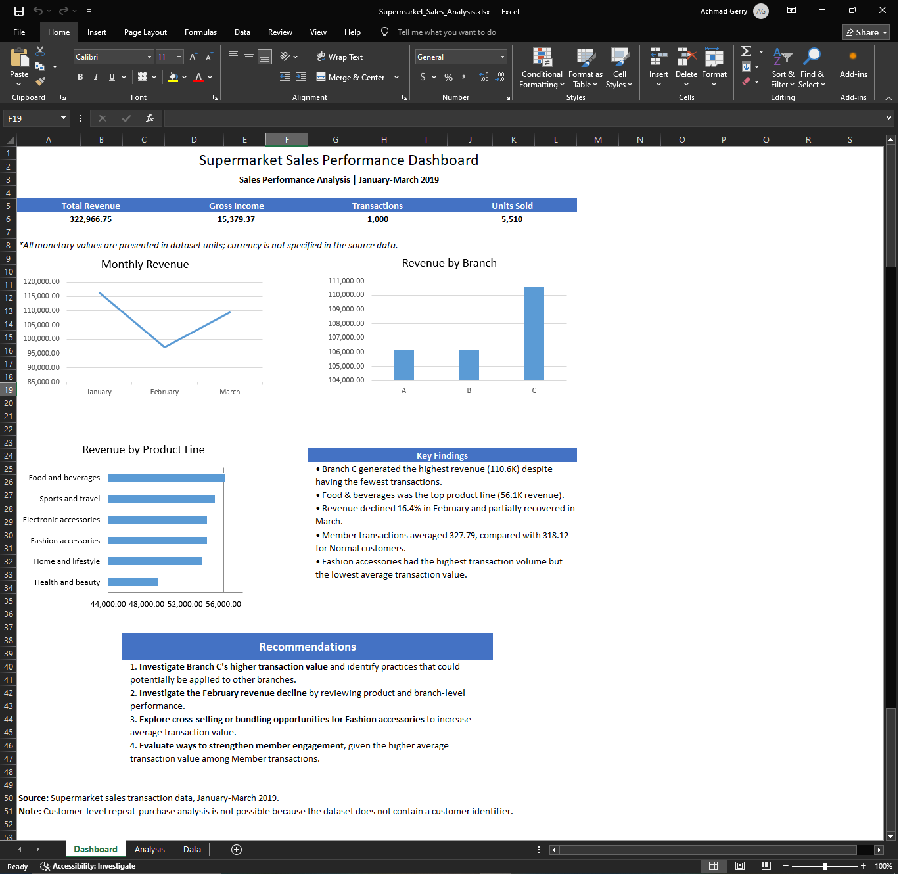

Supermarket Sales Performance Analysis

Project Overview

This project analyzes supermarket sales transactions to understand sales performance and find areas that may need further investigation.

The dataset contains sales from January to March 2019. I used Python for data understanding, cleaning, validation, analysis, and visualization. I then loaded the cleaned data into PostgreSQL for SQL analysis and used Excel 2019 to build a management-style dashboard.

Workflow:

Data Understanding -> Data Cleaning -> PostgreSQL -> SQL Analysis -> Python Analysis -> Excel Dashboard -> Recommendations

Business Questions

The analysis focuses on these questions:

- How much revenue and gross income did the supermarket generate?
- How did revenue change from month to month?
- Which branch generated the most revenue?
- Which product lines performed best and worst?
- Do Member and Normal customers have different average transaction values?
- Which payment methods are used most often?
- Which areas should management investigate further?

Dataset

The dataset contains 1,000 supermarket sales transactions from January 1, 2019 to March 30, 2019.

It has 17 columns:

- Invoice ID
- Branch
- City
- Customer type
- Gender
- Product line
- Unit price
- Quantity
- Tax
- Total
- Date
- Time
- Payment
- COGS
- Gross income
- Gross margin percentage
- Rating

Each row represents one transaction, and each transaction has a unique Invoice ID.

Tools

- Python
- Pandas
- PostgreSQL
- SQL
- Excel 2019
- Git/GitHub

Data Understanding

I first inspected the raw dataset with Python before loading it into PostgreSQL.

Initial profile:

- Rows: 1,000
- Columns: 17
- Date range: January 1, 2019 to March 30, 2019
- Unique Invoice IDs: 1,000
- Missing values: 0
- Duplicate rows: 0

The dataset contains transaction-level information for three branches, six product lines, two customer types, and three payment methods.

Initial business metrics:

- Total Revenue: 322,966.75
- Gross Income: 15,379.37
- Transactions: 1,000
- Units Sold: 5,510
- Average Transaction Value: 322.97
- Average Gross Income per Transaction: 15.38

Data Cleaning and Validation

The dataset was relatively clean, but I still performed data quality checks before analysis.

Cleaning steps:

1. Standardized column names to snake_case.
2. Converted numerical columns to numeric data types.
3. Converted date and time fields to the appropriate types.
4. Checked categorical values for unexpected values.
5. Checked numerical fields for invalid values.
6. Checked for missing values and duplicate rows.
7. Validated calculated sales fields.
8. Saved the cleaned dataset as supermarket_sales_cleaned.csv.

Validation results:

- Missing values: 0
- Duplicate rows: 0
- Invalid quantities: 0
- Invalid unit prices: 0
- Invalid ratings: 0
- COGS calculation mismatches: 0
- Total calculation mismatches within the validation tolerance: 0

During validation, 12 transactions showed very small differences between the recorded Total and the calculated value. The differences were about 0.01 or less and were caused by decimal rounding/precision.

I adjusted the validation logic to account for small decimal precision differences. After that, all calculated-field checks passed.

No transactions were removed, so the final dataset remained 1,000 rows and 17 columns.

PostgreSQL and SQL

After cleaning and validating the data in Python, I loaded it into PostgreSQL.

The project uses one table:

Table: supermarket_sales

Primary key: invoice_id

The single-table design was used because the dataset already contains transaction-level information and does not provide separate customer, product, branch, or order-line tables.

PostgreSQL was used for structured storage, validation, and SQL analysis.

SQL analysis covered:

- Overall sales performance
- Monthly revenue
- Branch performance
- Product-line performance
- Customer type
- Payment methods
- Calculated business metrics

SQL techniques used:

- SELECT and filtering
- SUM and COUNT
- COUNT(DISTINCT)
- GROUP BY
- ORDER BY
- HAVING
- Calculated metrics
- Percentage calculations
- Date-based grouping
- Segment comparisons
- Basic window functions

Python Analysis

I used Python after cleaning the data to perform additional analysis and create visualizations.

The goal was not to repeat every SQL query. Instead, I used Python to explore the data and make important patterns easier to see.

Python was used to:

- Load the cleaned data with Pandas
- Create summary tables
- Analyze monthly revenue
- Compare branches
- Compare product lines
- Calculate average transaction values
- Create charts for the analysis
- Export analysis results for reporting

Visualizations included:

- Monthly revenue trend
- Revenue by branch
- Product-line performance
- Average transaction value by product line

Excel Dashboard

Excel 2019 was used to create a management-style dashboard.

The dashboard gives a quick view of the main sales results without requiring the user to look through the raw data or SQL queries.

Key KPIs:

- Total Revenue: 322,966.75
- Gross Income: 15,379.37
- Total Transactions: 1,000
- Total Units Sold: 5,510

The dashboard also shows:

- Monthly revenue
- Revenue by branch
- Revenue by product line

The workbook has three main sheets:

- Dashboard - presentation and management summary
- Analysis - supporting calculations and analysis tables
- Data - cleaned transaction-level dataset

Key Findings

1. Overall Performance

The supermarket generated 322,966.75 in revenue and 15,379.37 in gross income from 1,000 transactions.

A total of 5,510 units were sold. The average transaction value was 322.97 and the average gross income per transaction was 15.38.

2. Monthly Sales

January had the highest revenue at 116,291.87.

Revenue fell to 97,219.37 in February, a decrease of about 16.4% from January.

Revenue increased again in March to 109,455.51, but it was still below January.

Because the dataset covers only about three months, the February decline should be treated as something to investigate, not as proof of a seasonal trend.

3. Branch Performance

Branch C generated the highest revenue at 110,568.71.

Branch A generated 106,200.37, while Branch B generated 106,197.67.

Branch C had the fewest transactions but the highest average transaction value at 337.10. Branch A had 312.35 and Branch B had 319.87.

The revenue difference between Branch C and Branch B was about 4,371.04.

The higher average transaction value is one possible reason for Branch C's stronger revenue performance and should be investigated further.

4. Product-Line Performance

Food and beverages had the highest revenue at 56,144.84.

Health and beauty had the lowest revenue at 49,193.74.

Fashion accessories had the highest number of transactions at 178, but the lowest average transaction value at 305.09.

Home and lifestyle had the highest average transaction value at 336.64.

This shows that transaction volume and transaction value do not always give the same result.

5. Customer Type

Member customers made 501 transactions and generated 164,223.44 in revenue.

Normal customers made 499 transactions and generated 158,743.31 in revenue.

Members had a higher average transaction value at 327.79 compared with 318.12 for Normal customers.

However, there is no unique customer ID in the dataset. Because of this, I cannot measure repeat purchases, customer retention, purchase frequency, or customer lifetime value.

The difference between Member and Normal customers should therefore be treated as an observed association, not proof that membership causes higher spending.

6. Payment Methods

Ewallet was used for 345 transactions, Cash for 344, and Credit card for 311.

Cash generated the highest revenue at 112,206.57 and had an average transaction value of 326.18.

Profitability and Limitations

The dataset contains COGS and gross income, but it does not contain operating expenses such as rent, salaries, utilities, or marketing costs.

Because of this, gross income is used as the available profitability-related measure. The analysis does not represent the supermarket's full net profitability.

Gross income was approximately 4.76% of revenue across the dataset.

The gross margin percentage is constant in the dataset, so differences in gross income between product lines are mainly related to revenue and sales volume rather than different margin rates.

Business Recommendations

1. Investigate Branch C

Look at what is driving Branch C's higher average transaction value. Product mix, purchasing behavior, or sales practices could be possible factors.

2. Investigate the February decline

Break February revenue down by branch and product line to find which areas contributed most to the decline.

3. Explore cross-selling for Fashion accessories

Fashion accessories had the highest number of transactions but the lowest average transaction value. Bundling or cross-selling could be tested to increase basket size.

4. Maintain Food and beverages performance

Food and beverages generated the highest product-line revenue. It would be useful to check which products are driving this result and make sure strong sellers remain available.

5. Evaluate Member engagement

Members had a higher average transaction value than Normal customers. Management could look at whether membership benefits or engagement activities are related to this difference.

6. Collect better data for future analysis

Customer IDs, product IDs, and operating expense data would allow deeper analysis of customer behavior, product profitability, retention, and net profitability.

Project Structure

The project is organized into the following main components:

data/
raw/ - original dataset
cleaned/ - validated and cleaned dataset

excel/
Supermarket_Sales_Analysis.xlsx
Excel 2019 dashboard and supporting analysis

outputs/
CSV files containing analysis results used for reporting

python/
01_data_understanding.py - initial data inspection
02_data_cleaning.py - data cleaning and validation
03_analysis.py - analysis and visualizations

screenshots/

sql/
01_schema.sql - PostgreSQL table definition
02_data_validation.sql - database validation checks
03_sql_analysis.sql - SQL business analysis

README.md
Project documentation

Conclusion

This project helped me practice a complete, beginner-friendly sales analysis workflow.

I started by understanding and validating the raw data, then performed manageable cleaning before loading the data into PostgreSQL.

I used SQL to answer the main business questions, Python to explore the data and create visualizations, and Excel 2019 to present the results in a dashboard.

The main findings were differences in monthly revenue, branch performance, product-line performance, customer type, and payment methods. These findings were then turned into practical areas for further investigation.

The project is intentionally kept at a practical level. The goal is to demonstrate data understanding, cleaning, SQL analysis, Python analysis, dashboarding, and business thinking without building a more complex data pipeline than the dataset requires.

Skills Demonstrated

- Data understanding and profiling
- Data cleaning and validation with Python
- Pandas data analysis
- PostgreSQL database creation and data loading
- SQL aggregation and business analysis
- Calculated metrics and percentage analysis
- Date-based analysis
- Basic SQL window functions
- Data visualization with Python
- Excel 2019 dashboard development
- Business-focused interpretation
- Communicating findings and recommendations
- Git/GitHub project organization
